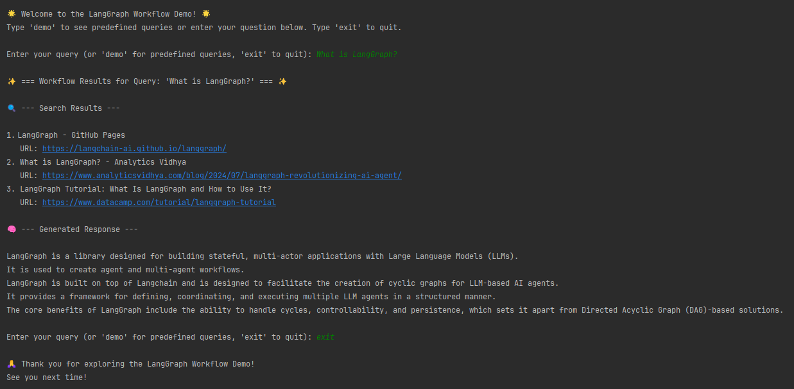

# Tavily LLM Workflow Agent

## 📚 Overview

This project integrates a LangGraph workflow with **Tavily's search API** and **OpenAI's GPT-4** for intelligent query processing. Using a **Retrieval-Augmented Generation (RAG)** architecture, the system retrieves real-time search results from Tavily and generates meaningful, context-aware responses with GPT-4.

The application includes:
- **Query Handling**: Fetch real-world, real-time data using Tavily's API.
- **Contextual Responses**: Generate user-friendly, accurate answers using GPT-4.
- **Streamlined Interaction**: Support both predefined and user-input queries.
- **Error Feedback**: Provide clear and actionable error messages for enhanced usability.


### Example Interface
Here’s an example of the interactive CLI interface:

---

## 🛠️ Architecture Design

### **Retrieval-Augmented Generation (RAG)**
The workflow follows the **RAG architecture**, which consists of three steps:
1. **Retrieve**: Query Tavily API to obtain relevant search results.
2. **Augment**: Process and extract the most relevant information as context.
3. **Generate**: Use GPT-4 to generate a response using the retrieved context.

This design ensures reliable and grounded responses by reducing hallucinations and improving accuracy.

---

## ⚙️ Project Setup

Follow these steps to set up and run the project:

### **1. Prerequisites**
- **Python**: Version 3.8 or later.
- **API Keys**:
  - **Tavily API Key**: [Sign up here](https://tavily.com/) to get your key.
  - **OpenAI API Key**: [Sign up here](https://platform.openai.com/signup/) to get your key.
  

### **2. Clone the Repository**
```bash
git clone [<repository_url>](https://github.com/YuvalSabag/Tavily_LLM_Agent)
cd Tavily_LLM_Agent
```
### **3. Install Dependencies**
Create and activate a virtual environment, then install the required packages:
```bash
python -m venv venv
source venv\Scripts\activate  # source venv/bin/activate (for Linux/Mac)
pip install -r requirements.txt
```
Install the required Python packages:
```bash
pip install -r requirements.txt
```
### **4. Set Up Environment Variables**
Create a `.env` file in the root directory and include your API keys:
```
TAVILY_API_KEY=<your_tavily_api_key>
OPENAI_API_KEY=<your_openai_api_key>
```

### **5. Run the Demo**
Launch the interactive demo:
```bash
python demo.py
```

You can:
- Enter queries directly in the terminal.
- Type `demo` to run predefined queries.
- Type `exit` to quit the demo.

---

## 📋 Dependencies
1. **python-dotenv**: For managing environment variables.  
2. **requests**: For Tavily API integration.  
3. **openai**: For GPT-4 communication.  
4. **tiktoken**: For token management.  
5. **langchain**: For workflow automation.  

---

## 🔍 Code Overview

The project is organized into several key components:

### 1. **`integration_nodes.py`**
   - Handles API interactions with Tavily and OpenAI GPT-4.
   - Includes error handling for:
     - Missing API keys.
     - API rate limits and retries.
     - Invalid or empty query inputs.

### 2. **`langgraph_workflow.py`**
   - Manages the main workflow:
     1. **Fetch**: Retrieves search results from Tavily API.
     2. **Process**: Prepares and structures data for GPT-4.
     3. **Generate**: Produces context-aware responses with GPT-4.
   - Ensures token limits are respected and implements robust error handling.

### 3. **`main.py`**
   - Executes predefined queries to test the full workflow.
   - Validates API keys during startup.
   - Logs query processing and results for debugging. 


### 4. **`demo.py`**
   - Provides an interactive Command-Line Interface (CLI) for real-time testing of the system.  
   - Features include:
     - Support for user-input queries.
     - Execution of predefined queries for demonstration purposes.
     - User-friendly error messages for invalid inputs or API issues.  

#### Configuration Notes:
- Ensure API keys for Tavily and OpenAI are set in a `.env` file in the root directory.
- Use this file (`config.py`) to manage and validate API keys and other configurations.
